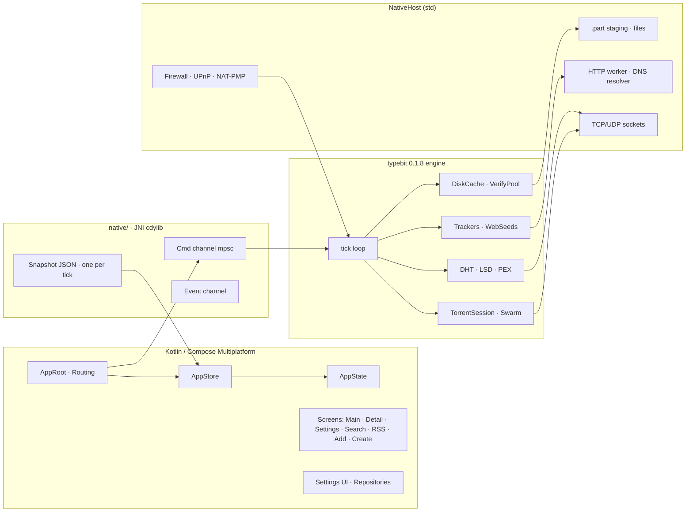
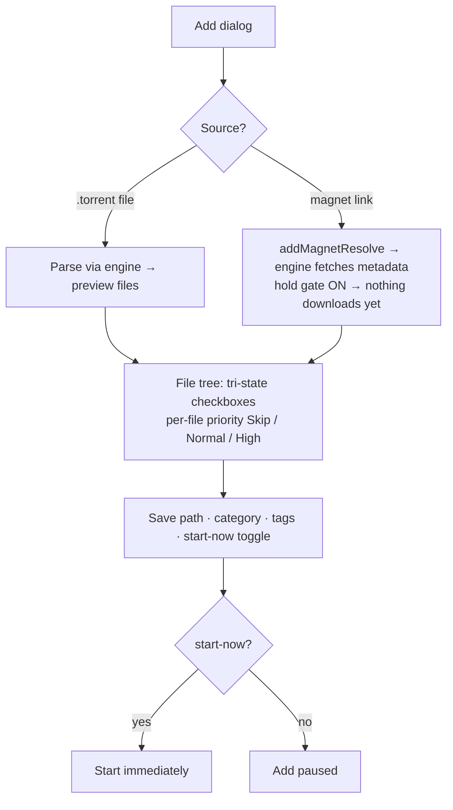
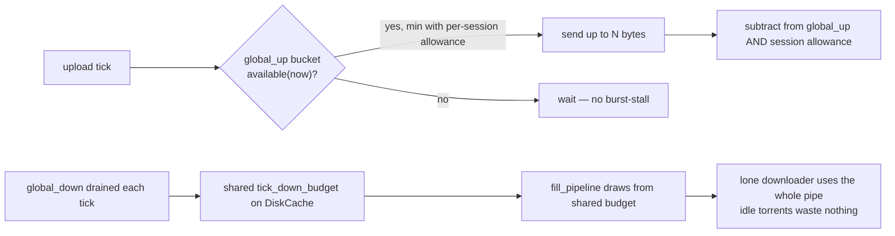
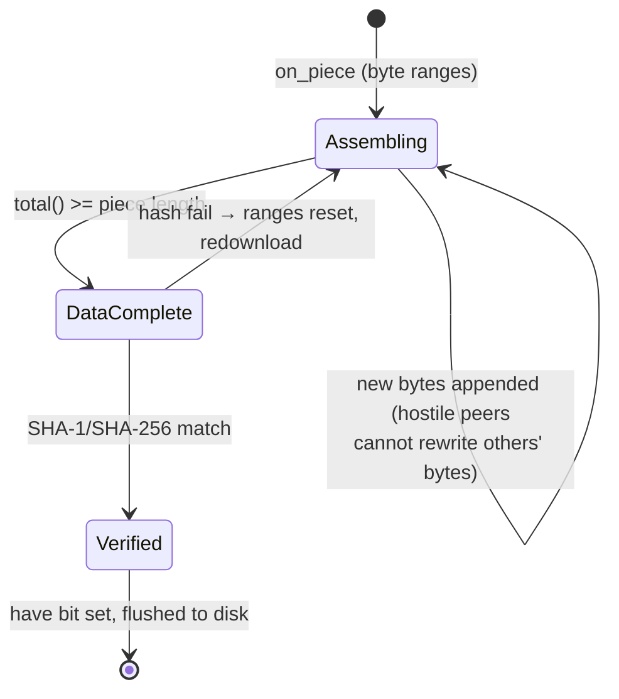
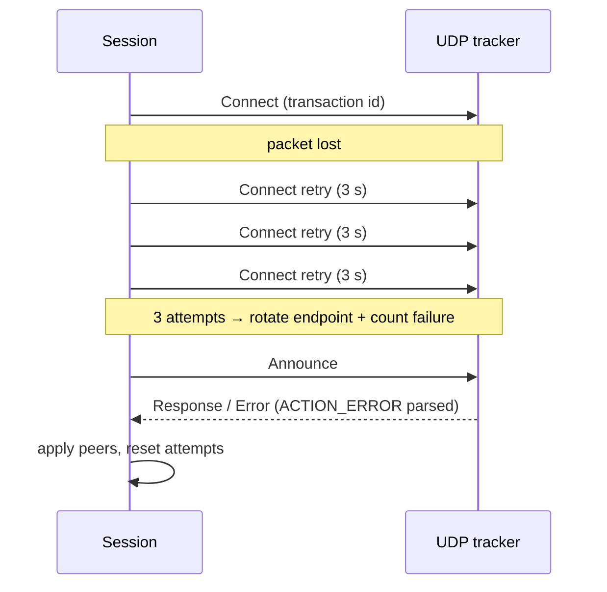
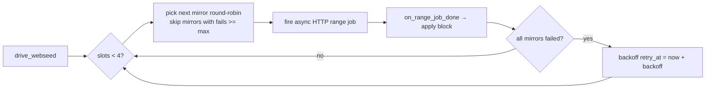
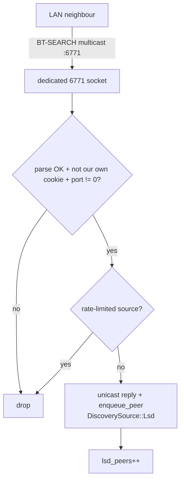

# TypeBitTorrent

> A BitTorrent client where the UI is a thin Kotlin/Compose shell and the
> brain is a `no_std + alloc` Rust engine. Windows desktop + Android from one
> codebase. The UI thread has never touched a socket; the engine thread has
> never touched a composable.



## index

- [why](#why)
- [the stack](#the-stack)
- [user guide](#user-guide) — how to actually use this thing
- [engine deep-dive](#engine-deep-dive) — how it works under the hood
- [war stories](#war-stories)
- [honest limitations](#honest-limitations)
- [build from source](#build-from-source)
- [docs & license](#docs--license)

## why

qBittorrent is great and also a giant C++ monolith you cannot embed. libtorrent
is a library but the learning curve is a cliff. I wanted an engine that is
(a) actually embeddable, (b) small enough to read in an afternoon, and
(c) honest about what it does. So `typebit` exists: a Rust engine with a clean
`Host` trait and zero opinions about pixels.

## the stack

```
composeApp/
  src/commonMain/    UI, store, models, settings, engine facade
  src/jvmShared/     JNI external declarations + JVM helpers
  src/androidMain/   Android entry, platform actuals, manifest
  src/desktopMain/   Desktop entry, AWT, resource loader
native/              Rust JNI bridge (Host impl + worker threads)
scripts/             build-desktop.ps1 · build-android.ps1
docs/                architecture.md · settings.md
```

---

## user guide

This section is the manual. Read it once, then just use it.

### first launch

| step | desktop | android |
|------|---------|---------|
| 1 | Unzip the portable folder (or run the installer) and start `TypeBitTorrent.exe` | Install the APK, grant network permission when asked |
| 2 | The engine spawns on a Rust thread in the background — you'll see live DHT/Tracker counters in the status bar | The engine spawns at process start; the status row shows DHT / Tracker / ↓↑ rates |
| 3 | Open **Settings → Connection** and confirm the listen port (default `6881`) is forwarded in your router if you want inbound peers | Same port; Android holds a WiFi multicast lock automatically for LAN discovery |
| 4 | Add your first torrent (below) | Add your first torrent (below) |

> On Windows, run **Settings → BitTorrent → Windows 防火墙与共享 → 自动配置**
> once (needs admin). It opens inbound TCP+UDP for your listen port **and**
> UDP `6771` so LSD (BEP-14) LAN discovery works on the same router.

### adding a torrent

Hit the **＋** button (desktop toolbar / Android bottom bar **添加**). The
add dialog is two-phase and qBittorrent-shaped:



- **`.torrent` file** — pick it, the file list appears instantly (parsed by
  the engine, not guessed).
- **Magnet** — paste `magnet:?xt=urn:btih:…`. The task is created immediately
  (it's a *real* task now, closing the dialog won't kill it), metadata is
  fetched in the background, and the file tree appears as soon as the info
  arrives. **The hold gate keeps it from downloading a single byte until you
  pick files.**
- **File tree** — folders collapse/expand, tri-state checkboxes (unchecked =
  **Skip**, that file never touches disk, not even a `.part`), per-file
  priority dropdown. Uncheck everything you don't want; only your selection
  is downloaded.
- **Save path / category / tags / 添加后开始下载** — the usual. Categories
  map to folders if you enable Automatic Torrent Management.
- Two-phase magnet: if you close the dialog before the metadata resolves, the
  task stays (paused-ish); when metadata lands it starts. You can also
  release it to download everything (qBittorrent behavior).

### the main screen

**Desktop** — permanent sidebar with 13 filters + a search box, a toolbar
(search / stats / list-grid toggle / settings / **create torrent** / **add**),
and the torrent table. The detail panel slides in at the bottom when you
select a torrent.

**Android** — bottom navigation: **种子 / 添加 / 搜索 / RSS / 设置**. The
torrent list shows cards (switch to grid with the view toggle); long-press a
card for the action sheet.

**Filters** (sidebar / chips): 全部 · 下载中 · 做种中 · 已完成 · 正在执行 ·
已暂停 · 活跃 · 不活跃 · 已停止 · 停止上传 · 停止下载 · 正在检查 · 出错.

**Sort** — by name / availability / download speed / upload speed / share
ratio (desktop and mobile both have a sort menu).

**Row actions** (table row context menu / long-press): **重命名**, **分享**
(magnet / info hash), **暂停 / 继续**, **删除** (with confirmation, removes
`.part` staging files too).

**Batch** — desktop has **全部开始 / 全部暂停** above the list.

### the detail panel (5 tabs)

| tab | what you get |
|-----|--------------|
| **信息** | size, progress, piece stats, created-by/at, comment, save dir, ratio, speeds. Unfinished files honestly say "暂存为 .part，校验通过后自动重命名" |
| **文件** | full file tree; per-file priority; **rename** a file while downloading (`.part` is promoted to the new name at completion); **▶ play** on any video file |
| **Tracker** | every announce URL with tier, live status (工作/更新/异常), seeds & leechers; add / remove trackers at runtime |
| **Peers** | **real** connected peers — address, client fingerprint, country flag, progress, ↑↓ rates, in-flight requests; refreshes every 2 s |
| **分块** | piece bitfield rendered live — see exactly which pieces are verified |

### watch while you download

Video files (ts / avi / rmvb / wmv / mp4 / mkv / …) are downloaded
**head-first, then strictly in file order** — banded sequential piece
picking; rarity never overrides order. In the **文件** tab hit **▶** on a
video:

- **Android** — hands the live `.part` to the system player via a FileProvider
  content-URI grant.
- **Desktop** — `Desktop.open()` on the `.part`; your default player starts
  as soon as the head lands and streams the body as it arrives.
- The tail (e.g. an MP4 `moov` atom) is fetched last, so seeking near the end
  works once it lands.

### search

**搜索** queries six engines in the background with human-like pacing and
returns **real magnet links** (no browser tabs): Nyaa, 1337x (with mirror
fallback), The Pirate Bay (with mirror fallback), plus the Chinese magnet
indexes 黑马磁力 / 磁力多 / 搜番. Each engine shows a live status
(RUNNING / DONE / BLOCKED / FAILED). Every result has a one-click **添加**
that feeds `addMagnetEx` — straight into the add flow.

> The search client sends a browser UA, keeps cookies, and paces requests so
> it doesn't get you (or the site) rate-limited. Online-video / cloud-drive
> titles are filtered out of results.

### RSS

**RSS** is a reader, not an auto-downloader: paste any RSS/Atom URL, hit
**订阅**, it fetches and parses (title, link, description) every refresh,
entries open in your browser. Remove a feed with the trash icon. Feeds
persist across restarts.

### create a torrent

**Create** (desktop toolbar or Android top-bar icon) → pick files (AWT
multi-select on desktop; SAF on Android), choose **piece length** (16 KiB …
256 MiB — 128/256 MiB are first-class options for huge files), name, announce
URLs, comment. The engine streams SHA-1 across file boundaries (1 MiB chunks)
and writes a `.torrent` you can share. On Android the file lands via
Create-Document (SAF).

### stats dialog

The **bar-chart button** opens a live stats dialog (1 s refresh):

- **用户统计** — global ↓↑ totals, share ratio, cache read-hit rate
- **缓存统计** — used / budget, clean + dirty entries, discarded bytes
- **性能统计** — write/read overload indicators
- **网络统计** — DHT nodes, active trackers, **external IP:port** (BEP-42),
  and the **LSD counters**: `lsd_sent` / `lsd_recv` / `lsd_peers`

> **Reading the LSD counters** (BEP-14 LAN discovery):
> - `sent` grows → you're announcing.
> - `sent` grows but `recv` = 0 on the same router → AP isolation or a
>   firewall blocking inbound UDP 6771 (desktop: re-run the firewall button).
> - `recv` > 0 but `peers` = 0 → announces arrive but no shared torrents, or
>   the return path is blocked.

### android specifics

- **锁屏后继续下载** (Settings → 行为): when on, an Android foreground
  service + wake lock keep the engine alive with the screen off. The
  **忽略电池优化** button walks you through the system exemption (required on
  some OEM ROMs for background networking).
- **Back gesture**: back from a sub-screen returns to the main screen instead
  of quitting; back in the detail panel closes it.
- The **WiFi multicast lock** is acquired in `Application.onCreate`, before
  the engine creates any socket — OEM ROMs won't enable multicast
  retroactively, so LSD works from the very first announce.

### settings reference

Every category mirrors qBittorrent's options dialog. Settings are persisted
immediately (no save button), engine-relevant ones are pushed live to the
engine on change.

#### 外观 (Appearance)

| setting | default | meaning |
|---------|---------|---------|
| 主题模式 | SYSTEM | System / Light / Dark / AMOLED (pure black) |
| 字体 | DEFAULT | Inter+Noto Sans SC / Roboto / Open Sans / Noto Sans SC / System |
| 壁纸 | off | blurred + dimmed wallpaper behind the whole UI |
| 模糊半径 | 24 px | wallpaper gaussian radius (pre-blurred once, cached) |
| 遮罩浓度 | 0.45 | black/white readability scrim, 0..0.85 |
| 显示模式 | Crop | Crop (fill) or Fit (letterbox) |
| 垂直偏移 | 0 | wallpaper pan in Crop mode, −1..1 |
| 种子色 | auto | manual Material You seed color override (wins over wallpaper) |

#### 行为 (Behavior)

| setting | default | meaning |
|---------|---------|---------|
| 语言 | system | UI language |
| 退出/删除确认 | on | confirmation dialogs |
| 启动最小化 / 最小化到托盘 / 关闭到托盘 | off | desktop window behaviour |
| 通知 | on | added / finished / new-version notifications |
| **后台下载** | on | Android foreground service + wake lock while active |
| 刷新间隔 | 500 ms | UI cadence (also drives the engine poll loop) |

#### 下载 (Downloads)

| setting | default | meaning |
|---------|---------|---------|
| 默认保存路径 | empty | where torrents land |
| 临时路径 | off | stage elsewhere, move at completion |
| 预分配磁盘 | off | *(see BitTorrent → 磁盘分配 for the real 3-mode preallocation)* |
| 添加后暂停 | off | add all new torrents paused |
| 最大活跃 下载/上传/总数 | 3 / 3 / 5 | active-torrent limits |
| 自动 Torrent 管理 | off | category → save path mapping |
| 分享率 / 时间限制 | off | auto-stop a torrent at ratio / time |

#### 连接 (Connection)

| setting | default | meaning |
|---------|---------|---------|
| 监听端口 | 6881 | BT listen port (random-port mode supported) |
| 最大连接数 | 500 | global connections |
| 每任务最大连接 | 100 | per-torrent cap |
| 上传槽 | 8 / 4 | global / per-torrent unchoke slots |
| 协议 | TCP+UDP | TCP / UDP only |
| 代理 | 无 | **SOCKS5 only** (honest: SOCKS4/HTTP settings are stored but never enable a proxy — the engine implements SOCKS5) |

#### 速度 (Speed)

| setting | default | meaning |
|---------|---------|---------|
| 全局 下载/上传 限速 | 0 (unlimited) | KiB/s hard ceiling (see the tolerance table in the deep-dive) |
| 备用限速 | 10 MiB / 3 MiB | alternative limits |
| 定时切换 | off | schedule alternative limits by days + time window |

#### BitTorrent

| setting | default | meaning |
|---------|---------|---------|
| DHT / PEX / LSD | on | discovery mechanisms (BEP-5 / PEX / BEP-14) |
| UPnP / NAT-PMP | on | dual-protocol port mapping (both protocols actually mapped) |
| 每任务最大 Peers | 80 | swarm cap per torrent |
| **请求管线** | 32 | per-peer in-flight 16 KiB blocks (≤512 KiB/peer) |
| **请求超时** | 20 s | per-request timeout, pipeline-aware |
| **最大连续超时** | 8 | consecutive empty windows before a ban |
| 冲突分块 | 32 | endgame duplicates |
| 使用默认 Tracker | on | community fallback trackers appended to every torrent |
| 反吸血 | on | fingerprint + reputation + hard bans |
| **屏蔽吸血客户端** | on | Xunlei/Thunder/FlashGet etc. are never unchoked |
| 额外 Tracker | empty | one URL per line, applied to running torrents on change |
| 磁盘缓存 | 256 MiB | write-back cache budget |
| **磁盘分配** | 稀疏 | OFF (grow) / **SPARSE** (reserve, recommended) / FULL (zero-fill) |
| 做种/下载槽 | 8 / 8 | unchoke slots |
| 优化间隔 / 冷落超时 / 重新choke | 30 s / 60 s / 10 s | leech scheduler |
| 调度权重 α/β/γ/δ | 8/2/1/64 | utility scheduler (typebit-specific) |
| 内容布局 | 原始 | original / subfolder / no-subfolder |

#### WebUI

| setting | default | meaning |
|---------|---------|---------|
| 全部 | — | **Roadmap.** Settings persist but the built-in WebUI server does not ship yet. No pretending. |

#### 高级 (Advanced)

| setting | default | meaning |
|---------|---------|---------|
| 磁盘缓存 | 256 MiB | alias of BitTorrent cache |
| 保存续传间隔 | 60 s | resume-data write cadence |
| OS 缓存 | on | OS-level buffering |
| 套接字积压 / 发送缓冲水位 | 30 / 512 KiB | socket tuning |
| bdecode 深度/令牌上限 | 100 / 50M | metainfo parse guardrails |
| 最大并发 HTTP announce | 50 | tracker worker cap |
| Tracker 失败阈值 / 重试间隔 / 次数 | 3 / 30 s / 5 | tracker backoff policy |
| Peer 周转间隔 | 5 s | swap cadence |

#### RSS

| setting | default | meaning |
|---------|---------|---------|
| 刷新间隔 | 30 min | feed refresh cadence |
| 每源最大条目 | 50 | items kept per feed |
| 智能剧集过滤 | on | episode-aware filtering helper |

---

## engine deep-dive

This is where it gets interesting. Everything below is what `typebit` 0.1.8
actually does — no dashboard numbers, real behaviour.

### rate limiting is a hard ceiling, not a suggestion

Global and per-torrent limits are enforced by engine-side token buckets. The
upload path obeys a spec that reads like a tax table:

| limit      | allowed overshoot |
|------------|-------------------|
| 100 KiB/s  | 10%               |
| 200 KiB/s  | 9% (then −0.5% per extra 50 KiB) |
| 1 MiB/s    | 1% (floor)        |

Burst capacity is derived from the tolerance (`burst = rate × tol / 200`,
clamped to [4 KiB, 1 MiB]), so **any one-second window stays inside
`limit × (1 + tol)`**.



The old code divided each tick's allowance by the number of active torrents —
a lone downloader could never hit its limit, then burst 10× and go silent.
Now the global buckets are the only authority and idle torrents get nothing.

### downloads that don't self-destruct

The classic "seed fast, then dead; restart fixes it" failure had three
engine-side causes:

1. **Strict block validation was banning healthy seeds.** `on_piece` demanded
   exact 16 KiB alignment; non-conforming clients tripped a protocol
   violation, got dropped, got banned. Bans lived in memory, so a restart
   wiped them — *that's* why restart "fixed" it. Validation is now lenient
   (any in-piece window ≤ 16 KiB) and assembly is byte-exact.
2. **Flat timeouts burned deep pipelines.** A peer with 32 blocks outstanding
   legitimately answers the last one late. The timeout is now pipeline-aware
   (`timeout + in_flight × 250 ms`), and the ban bar is high: a peer must
   deliver *nothing* across 8 full windows.
3. **An empty swarm just sat there.** Losing the last ready peer now
   force-refreshes within 5 s (tracker announce + DHT lookup).

### 16 MiB pieces can finally pass integrity

Assembly is byte-exact — the session tracks the exact received byte ranges
per piece:



A short, misaligned, or duplicate block can never leave a zero-filled hole
that fails verification forever — which is exactly why large-piece (16 MiB)
torrents used to wedge at 99%. Resume only trusts verified `have` bits;
partial pieces re-download.

### trackers with manners

- **BEP-12 tiers** are preserved (`TrackerState.tier`) and announced in
  order: the torrent's own trackers first, config extras and community
  fallbacks after.
- **BEP-15 UDP** with fast retransmit — a lost connect packet is retried
  every 3 s (up to 3 attempts) before the endpoint rotates and a failure
  counts:



  One dropped datagram no longer costs a 15-second stall. v2/hybrid torrents
  announce the truncated 20-byte hash.
- **BEP-27 UTF-8** names (`name.utf-8` / `path.utf-8`) and the **BEP-10**
  extension handshake (ut_metadata / ut_pex) work.

### multi-thread + multi-mirror

- **Multi-thread**: every peer runs an independent pipeline (32 × 16 KiB in
  flight), bounded by a **global** in-flight window derived from the disk
  cache budget (`budget / 16 KiB`, ≥ 64 blocks). A torrent pulls from every
  peer the swarm offers.
- **Multi-mirror**: `url-list` mirrors are used simultaneously — up to 4
  blocks in flight, round-robin across mirrors, per-mirror failure ledgers:



  Mirror A never waits for mirror B, and a dead mirror backs off instead of
  wedging the piece. (An early version retried a dead mirror every tick and
  hammered DNS at ~2 lookups/sec. Fixed, tested, done.)

### discovery — all of it

- **DHT (BEP-5)** with bootstrap resilience: survives a bootstrapless first
  boot, re-bootstraps by real node count (placeholder nodes don't count),
  refreshes the table with 3-node fan-out, and persists up to 160 nodes.
- **PEX** — `added` / `added.f` / `dropped` / `added6` / `p` / `p6` exchanged
  with peers; external port witnesses confirmed by ≥ 2 distinct peers and
  announced so you're reachable.
- **LSD (BEP-14)** — announces from a **dedicated port-6771 socket** (the
  spec does this for a reason), with anti-amplification (one unicast reply
  per source per 10 s) and burst-announce on active-set changes:



  If `sent` grows but `recv` stays 0 on the same router, that's AP isolation
  or a firewall — not the code. Android grabs the WiFi multicast lock at
  process start, before any socket exists, because OEM ROMs won't enable
  multicast retroactively.
- **uTP (BEP-29)** with LEDBAT exists in the engine. In practice peers
  usually negotiate plain TCP, and the wire is plaintext. We're honest about
  that.

### anti-leech that actually bites

Fingerprinting (`-XX####-` BEP-20 parsing) + reputation + hard bans. Known
leech clients (Xunlei, Thunder, FlashGet, …) are **never unchoked** — they
can still upload to us, but can never download from us. Three guardrails keep
it fair: **LAN/LSD neighbours are never identity-blocked** (they're on your
wifi), new connections get a probation grace window, and anyone who has
contributed more than the free-ride floor isn't blocked regardless of
fingerprint.

### everything else under the hood

- Selective download: `Vec<Option<DiskId>>` files — skipped files are **never
  opened**, no `.part`, no preallocation; runtime re-selection reopens on the
  next tick; in-flight requests for newly-skipped pieces are cancelled with
  `Cancel` immediately.
- A **hold gate** for magnets: the session refuses to pick anything until
  priorities are committed — a magnet can't start hoarding GBs while you're
  still choosing files.
- Parallel piece verification (`VerifyPool`), one batched native snapshot per
  poll tick instead of N JNI calls, a `catch_unwind`-wrapped engine tick that
  reports recovery to the UI instead of dying silently.
- Windows firewall rules (incl. UDP 6771 for LSD) + ICS sharing control,
  UPnP + NAT-PMP dual-protocol port mapping.

---

## war stories

- **"Restart fixes it"** was an in-memory ban list. Fixing it taught me more
  about BitTorrent client behaviour than any spec.
- **A 16 MiB piece stuck at 99%** wasn't the hash — it was a half-block marked
  "received" with a gap nobody would ever fill. Byte-exact ranges fixed it.
- **DHT showing 0 after a few minutes** was the engine thread dying on a panic
  while the UI kept polling a corpse. Every engine tick is now wrapped in
  `catch_unwind`, and recovery is reported back to the UI.
- **LSD invisible on the same router**: three separate causes — a missing
  Windows firewall rule for UDP 6771, announces sent from the wrong socket,
  and an Android multicast lock taken too late. All three fixed; the counters
  in 统计 → 网络统计 prove it live.

## honest limitations

- Not every qBittorrent counter exists. Where the engine can't report a number
  honestly, the UI shows `—` instead of inventing one.
- uTP is implemented but most peers pick TCP; "encryption mode" settings are
  stored UI — the wire is plaintext.
- The WebUI server is on the roadmap; its settings persist but serve nothing.
- The search engines are scraped, not API-driven — sites change their HTML and
  an engine can go BLOCKED until the regex catches up.

## build from source

Prereqs: JDK 17, Android SDK + NDK for the `.so`s, Rust stable (1.95+) with
`aarch64-linux-android` / `armv7-linux-androideabi` / `x86_64-linux-android`
targets (x86 too, because emulators).

```powershell
# 1. desktop DLL → composeApp/src/desktopMain/resources/native/typebit_native.dll
.\scripts\build-desktop.ps1

# 2. Android → composeApp/src/androidMain/jniLibs/<abi>/libtypebit_native.so
$env:ANDROID_NDK_HOME = "C:\Users\you\AppData\Local\Android\Sdk\ndk\..."
.\scripts\build-android.ps1

# 3. Kotlin
gradlew.bat :composeApp:run             # desktop
gradlew.bat :composeApp:assembleDebug   # Android APK
gradlew.bat :composeApp:createDistributable
```

The desktop DLL ships inside the app jar (`native/typebit_native.dll`); the
Android `.so`s live in `jniLibs`. If you `dir /s /b | findstr dll` the distro
and see nothing, that's because the DLL is *in the jar*. This has confused
exactly one person per release. Every release.

## docs & license

- `docs/architecture.md` — the full JNI protocol, threading model, and the
  tick loop.
- `docs/settings.md` — every setting, what drives it, what's stored-only.
- `NOTICE.md` — third-party notices.

**License**: app + bridge + engine — **PolyForm Perimeter 1.0.0**
(`LICENSE`, `NOTICE.md`). Not affiliated with qBittorrent, BitComet, or
libtorrent. They do their thing; we do ours.
