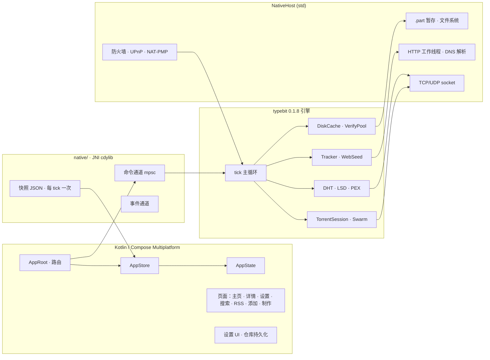
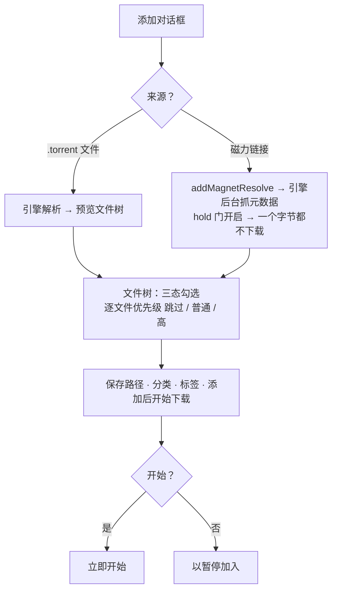
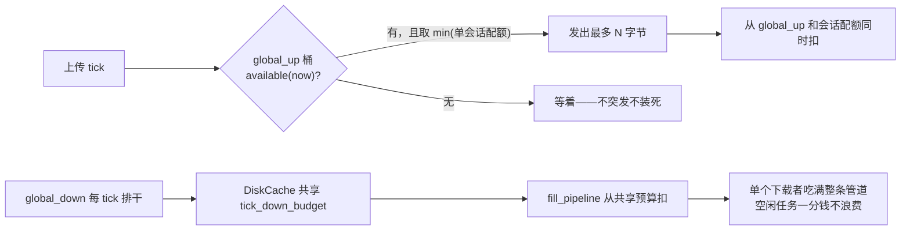
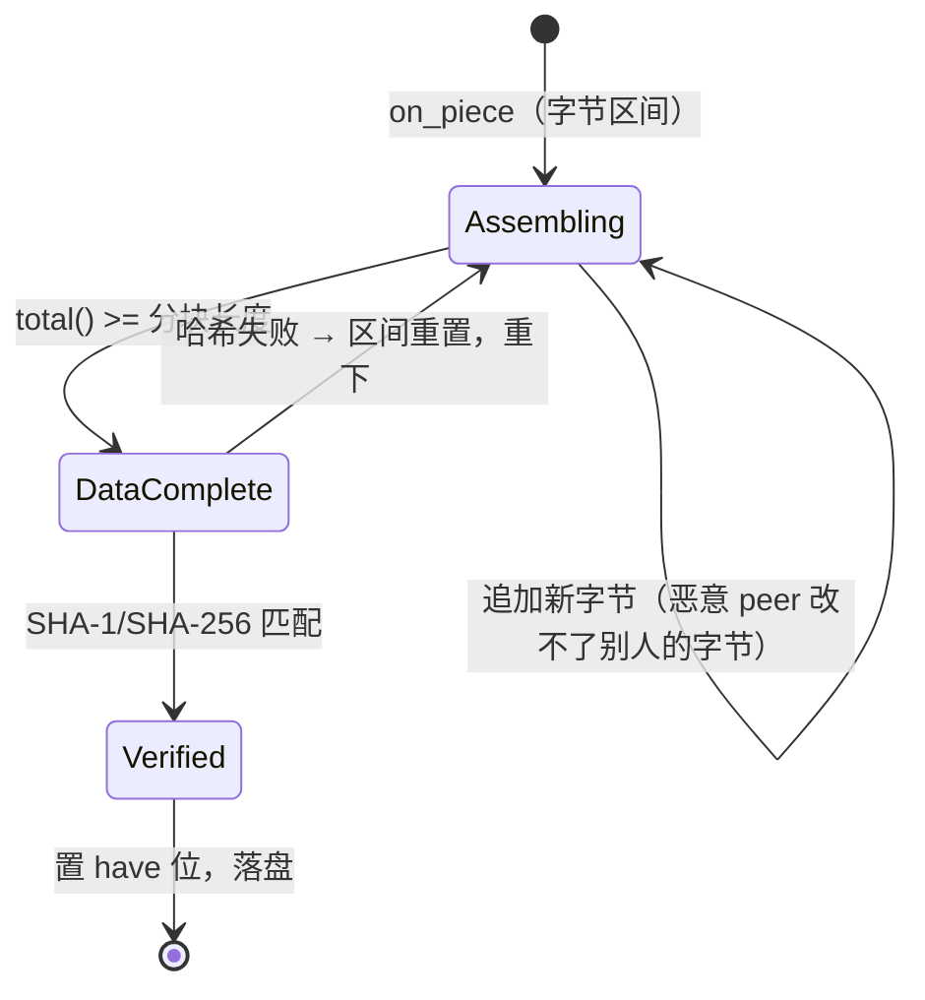
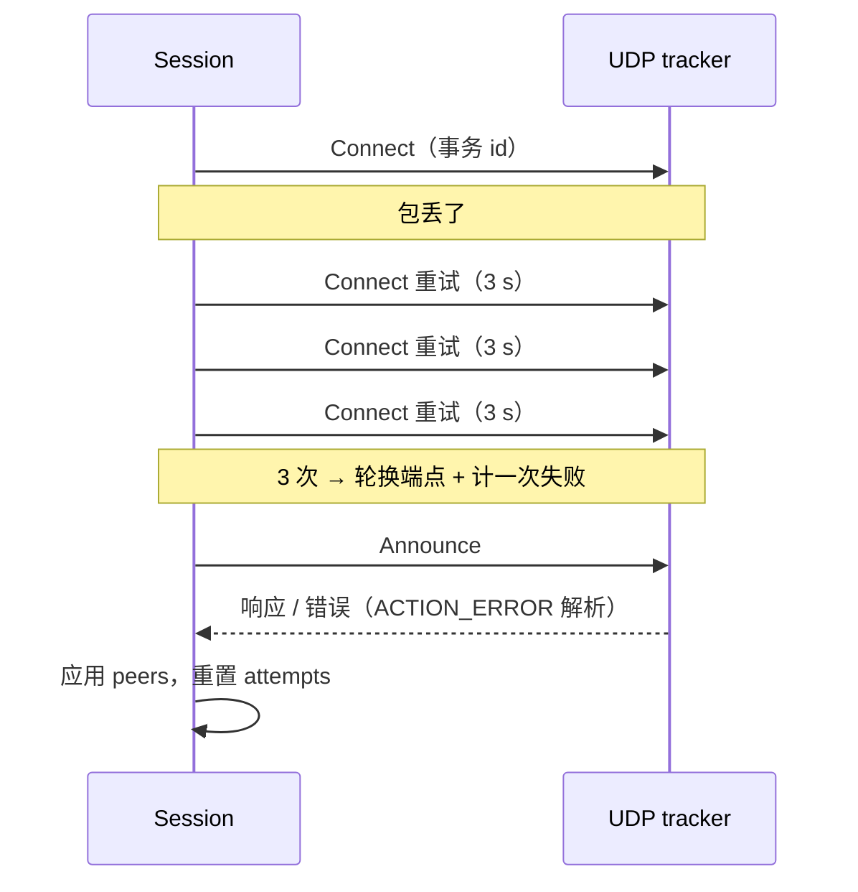
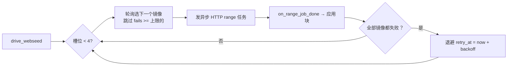
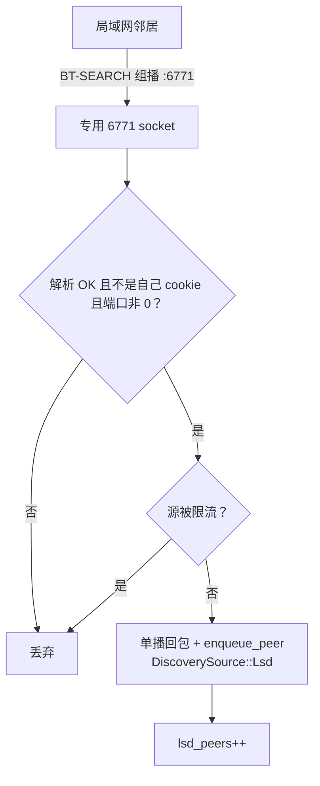

# TypeBitTorrent

> 壳是 Kotlin/Compose，脑子是 `no_std + alloc` 的 Rust 引擎。Windows 桌面 +
> Android，一套代码，两个前端。UI 线程一辈子没见过 socket，引擎线程也从不
> 碰 Compose。



## 目录

- [为什么](#为什么)
- [代码结构](#代码结构)
- [使用手册](#使用手册) —— 这东西到底怎么用
- [引擎深潜](#引擎深潜) —— 里面是怎么转的
- [踩过的坑](#踩过的坑)
- [老实交代](#老实交代)
- [从源码构建](#从源码构建)
- [文档与许可证](#文档与许可证)

## 为什么

qBittorrent 很好用，但它是一坨没法嵌进你自己程序里的 C++ 巨兽；libtorrent
是库，可那学习曲线是一面悬崖。我想要的引擎得满足三条：（a）真能嵌进去，
（b）小到一下午能读完，（c）干了什么就老实说什么。所以有了 `typebit`：
一个带干净 `Host` 的 Rust 引擎。

## 代码结构

```
composeApp/
  src/commonMain/    共享 UI、状态、模型、设置、引擎门面
  src/jvmShared/     JNI 声明 + JVM 助手
  src/androidMain/   Android 入口、平台实现、Manifest
  src/desktopMain/   桌面入口、AWT、资源加载
native/              Rust JNI 桥（Host 实现 + 工作线程）
scripts/             build-desktop.ps1 · build-android.ps1
docs/                architecture.md · settings.md
```

---

## 使用手册

这一节是说明书。读一遍，然后直接用。

### 首次启动

| 步骤 | 桌面 | Android |
|------|------|---------|
| 1 | 解压便携版（或装安装器）启动 `TypeBitTorrent.exe` | 安装 APK，按提示授予网络权限 |
| 2 | 引擎在后台 Rust 线程自动拉起——状态栏能看到实时 DHT/Tracker 计数 | 引擎随进程启动；顶栏显示 DHT / Tracker / ↓↑ 速率 |
| 3 | **设置 → 连接**确认监听端口（默认 `6881`），路由器做了端口转发才能收入站连接 | 同样端口；Android 会自动持有 WiFi 组播锁做局域网发现 |
| 4 | 添加第一个种子（见下） | 添加第一个种子（见下） |

> Windows 上请先跑一次 **设置 → BitTorrent → Windows 防火墙与共享 →
> 自动配置**（需要管理员）。它会放行监听端口的入站 TCP+UDP，**以及 UDP
> 6771**——LSD（BEP-14）局域网发现在同一路由器下能不能互相看见，就看这条
> 规则。

### 添加种子

点 **＋**（桌面工具栏 / Android 底栏 **添加**）。添加对话框是两阶段的，
长得像 qBittorrent：



- **`.torrent` 文件** —— 选中即出文件列表（引擎解析，不是猜的）。
- **磁力链接** —— 粘贴 `magnet:?xt=urn:btih:…`。任务**立即**创建（它是
  真任务了，关掉对话框也不会死），后台抓元数据，info 一到文件树就出现。
  **hold 门保证在你选好文件之前一个字节都不会下。**
- **文件树** —— 目录可折叠，三态勾选框（不勾 = **跳过**，该文件连
  `.part` 都不会出现在磁盘上），逐文件优先级下拉。不想要的全取消，只下
  你选的。
- **保存路径 / 分类 / 标签 / 添加后开始下载** —— 常规操作。开了自动
  Torrent 管理后分类映射到文件夹。
- 磁力两阶段：元数据没到就关对话框，任务保留；元数据到了自动开跑。也可以
  直接放手让它全量下载（qBittorrent 行为）。

### 主界面

**桌面** —— 左侧固定侧边栏 13 个筛选 + 搜索框，工具栏（搜索 / 统计 /
列表-网格切换 / 设置 / **制作种子** / **添加**），下面是种子表格。选中
种子后底部滑出详情面板。

**Android** —— 底部导航：**种子 / 添加 / 搜索 / RSS / 设置**。种子列表
是卡片（视图切换按钮可换网格）；长按卡片弹操作面板。

**筛选**（侧边栏 / 芯片）：全部 · 下载中 · 做种中 · 已完成 · 正在执行 ·
已暂停 · 活跃 · 不活跃 · 已停止 · 停止上传 · 停止下载 · 正在检查 · 出错。

**排序** —— 名称 / 可用性 / 下载速度 / 上传速度 / 分享率（桌面移动都有
排序菜单）。

**行操作**（表格行右键菜单 / 长按）：**重命名**，**分享**（磁力 / info
hash），**暂停 / 继续**，**删除**（有确认，连 `.part` 暂存文件一起清）。

**批量** —— 桌面列表上方有 **全部开始 / 全部暂停**。

### 详情面板（5 个标签页）

| 标签 | 内容 |
|------|------|
| **信息** | 大小、进度、分块统计、创建者/时间、备注、保存目录、分享率、速度。未完成文件老实写"暂存为 .part，校验通过后自动重命名" |
| **文件** | 完整文件树；逐文件优先级；**下载中重命名**（完成时 `.part` 提升为新名）；视频文件有 **▶ 播放** 按钮 |
| **Tracker** | 每个 announce URL 带层级和实时状态（工作/更新/异常）、种子与下载者数；运行时可增删 tracker |
| **Peers** | **真实**已连接 peer——地址、客户端指纹、国家国旗、进度、↑↓ 速率、在途请求；每 2 秒刷新 |
| **分块** | 分块位图实时渲染——哪块校验过了看得清清楚楚 |

### 边下边播

视频文件（ts / avi / rmvb / wmv / mp4 / mkv / …）按**文件头优先、随后严格
文件顺序**下载——分带顺序选块，稀有度永远不覆盖顺序。在**文件**页点视频
的 **▶**：

- **Android** —— 通过 FileProvider 临时授权把正在写的 `.part` 交给系统
  播放器。
- **桌面** —— 对 `.part` 调 `Desktop.open()`；头一落地默认播放器就开播，
  正片在身后追着你。
- 尾部（比如 MP4 的 `moov`）最后取，落盘后拖进度条到结尾也流畅。

### 搜索

**搜索**在后台用真人节奏轮询六个引擎并返回**真实磁力链接**（不开浏览器
标签页）：Nyaa、1337x（带镜像回退）、The Pirate Bay（带镜像回退），外加
国内磁力索引 黑马磁力 / 磁力多 / 搜番。每个引擎有实时状态
（RUNNING / DONE / BLOCKED / FAILED）。每条结果一键 **添加**，走
`addMagnetEx` 直接进添加流程。

> 搜索客户端带浏览器 UA、保留 Cookie、请求有人为节奏——别让站点（或你）
> 被限流。在线视频/网盘标题会被过滤掉。

### RSS

**RSS** 是阅读器，不是自动下载器：粘贴任意 RSS/Atom 地址，点 **订阅**，
抓取并解析（标题、链接、描述），刷新后条目点开进浏览器，垃圾桶图标取消
订阅。源跨重启持久化。

### 制作种子

**制作**（桌面工具栏 / Android 顶栏图标）→ 选文件（桌面 AWT 多选；Android
SAF），选**分块大小**（16 KiB … 256 MiB——大文件用 128/256 MiB 是一等
选项），填名称、announce 地址、备注。引擎跨文件边界流式算 SHA-1（1 MiB
分块），写出可分享的 `.torrent`。Android 上通过 Create-Document（SAF）落盘。

### 统计对话框

**柱状图按钮**打开实时统计（1 秒刷新）：

- **用户统计** —— 全局 ↓↑ 总量、分享率、缓存读命中率
- **缓存统计** —— 已用 / 预算、clean + dirty 条目、丢弃字节
- **性能统计** —— 写/读过载指示
- **网络统计** —— DHT 节点、活跃 tracker、**外网 IP:port**（BEP-42）、
  **LSD 计数器**：`lsd_sent` / `lsd_recv` / `lsd_peers`

> **怎么看 LSD 计数器**（BEP-14 局域网发现）：
> - `sent` 在涨 → 你在广播。
> - `sent` 涨但同路由下 `recv` = 0 → AP 隔离，或防火墙挡了入站 UDP 6771
>   （桌面：重跑一次防火墙按钮）。
> - `recv` > 0 但 `peers` = 0 → announce 到了但双方没有共同种子，或回包
>   路径被挡。

### Android 专属

- **锁屏后继续下载**（设置 → 行为）：开启后前台服务 + wake lock 让引擎在
  锁屏下继续跑。**忽略电池优化**按钮会引导你去系统豁免——某些 OEM ROM
  不做豁免就不给后台联网。
- **返回手势**：子页面返回主界面而不是退出；详情面板内返回关闭详情。
- **WiFi 组播锁**在 `Application.onCreate` 里、引擎创建任何 socket **之前**
  就获取——OEM ROM 不会事后补开组播，所以 LSD 从第一次 announce 就能收。

### 设置参考

每个分类都对齐 qBittorrent 的选项对话框。设置**立即持久化**（没有保存
按钮），能驱动引擎的改动会实时推到引擎。

#### 外观

| 设置 | 默认 | 含义 |
|------|------|------|
| 主题模式 | SYSTEM | 跟随系统 / 亮 / 暗 / AMOLED（纯黑） |
| 字体 | DEFAULT | Inter+Noto Sans SC / Roboto / Open Sans / Noto Sans SC / 系统 |
| 壁纸 | 关 | 全 UI 背后显示模糊+压暗的壁纸 |
| 模糊半径 | 24 px | 壁纸高斯模糊半径（预模糊一次、缓存） |
| 遮罩浓度 | 0.45 | 黑/白可读性压暗层，0..0.85 |
| 显示模式 | 裁剪 | 裁剪填充 或 完整适配（留黑边） |
| 垂直偏移 | 0 | 裁剪模式下壁纸上下平移，−1..1 |
| 种子色 | 自动 | 手动指定 Material You 种子色（优先于壁纸取色） |

#### 行为

| 设置 | 默认 | 含义 |
|------|------|------|
| 语言 | system | UI 语言 |
| 退出/删除确认 | 开 | 确认对话框 |
| 启动最小化 / 最小化到托盘 / 关闭到托盘 | 关 | 桌面窗口行为 |
| 通知 | 开 | 添加 / 完成 / 新版本通知 |
| **后台下载** | 开 | Android 前台服务 + wake lock（有活动任务时） |
| 刷新间隔 | 500 ms | UI 刷新节奏（同时驱动引擎轮询） |

#### 下载

| 设置 | 默认 | 含义 |
|------|------|------|
| 默认保存路径 | 空 | 种子落地位置 |
| 临时路径 | 关 | 先暂存别处，完成再移 |
| 预分配磁盘 | 关 | （真正的三模式预分配在 BitTorrent → 磁盘分配） |
| 添加后暂停 | 关 | 新种子一律暂停加入 |
| 最大活跃 下载/上传/总数 | 3 / 3 / 5 | 活跃任务数上限 |
| 自动 Torrent 管理 | 关 | 分类 → 保存路径映射 |
| 分享率 / 时间限制 | 关 | 达到比例/时间自动停止 |

#### 连接

| 设置 | 默认 | 含义 |
|------|------|------|
| 监听端口 | 6881 | BT 监听端口（支持随机端口） |
| 最大连接数 | 500 | 全局连接上限 |
| 每任务最大连接 | 100 | 单任务上限 |
| 上传槽 | 8 / 4 | 全局 / 每任务 unchoke 槽 |
| 协议 | TCP+UDP | TCP / 仅UDP |
| 代理 | 无 | **只支持 SOCKS5**（老实说：SOCKS4/HTTP 设置会存但永远不会启用代理——引擎只实现 SOCKS5） |

#### 速度

| 设置 | 默认 | 含义 |
|------|------|------|
| 全局 下载/上传 限速 | 0（不限） | KiB/s 硬顶（容差表见引擎深潜） |
| 备用限速 | 10 MiB / 3 MiB | 备用限速档 |
| 定时切换 | 关 | 按星期 + 时间段自动切备用限速 |

#### BitTorrent

| 设置 | 默认 | 含义 |
|------|------|------|
| DHT / PEX / LSD | 开 | 发现机制（BEP-5 / PEX / BEP-14） |
| UPnP / NAT-PMP | 开 | 双协议端口映射（两种协议都真映射） |
| 每任务最大 Peers | 80 | 单任务 swarm 上限 |
| **请求管线** | 32 | 每 peer 在途 16 KiB 块数（≤512 KiB/peer） |
| **请求超时** | 20 s | 单请求超时，管线感知 |
| **最大连续超时** | 8 | 连续 8 个空窗口才封禁 |
| 冲突分块 | 32 | endgame 重复请求数 |
| 使用默认 Tracker | 开 | 每个种子追加社区兜底 tracker |
| 反吸血 | 开 | 指纹 + 信誉 + 硬封禁 |
| **屏蔽吸血客户端** | 开 | 迅雷/闪电/FlashGet 等永远不会被 unchoke |
| 额外 Tracker | 空 | 每行一个 URL，变更时推给运行中种子 |
| 磁盘缓存 | 256 MiB | 写回缓存预算 |
| **磁盘分配** | 稀疏 | 关闭（随写增长）/ **稀疏**（预留，推荐）/ 完整（零填充） |
| 做种/下载槽 | 8 / 8 | unchoke 槽 |
| 优化间隔 / 冷落超时 / 重新choke | 30 s / 60 s / 10 s | leech 调度 |
| 调度权重 α/β/γ/δ | 8/2/1/64 | 效用调度器（typebit 专属） |
| 内容布局 | 原始 | 原始 / 子目录 / 无子目录 |

#### WebUI

| 设置 | 默认 | 含义 |
|------|------|------|
| 全部 | — | **路线图。** 设置会持久化，但内置 WebUI 服务器还没上线。不装。 |

#### 高级

| 设置 | 默认 | 含义 |
|------|------|------|
| 磁盘缓存 | 256 MiB | BitTorrent 缓存的别名 |
| 保存续传间隔 | 60 s | 续传数据写盘节奏 |
| OS 缓存 | 开 | 系统级缓冲 |
| 套接字积压 / 发送缓冲水位 | 30 / 512 KiB | socket 调优 |
| bdecode 深度/令牌上限 | 100 / 50M | 元数据解析护栏 |
| 最大并发 HTTP announce | 50 | tracker 工作线程上限 |
| Tracker 失败阈值 / 重试间隔 / 次数 | 3 / 30 s / 5 | tracker 退避策略 |
| Peer 周转间隔 | 5 s | 换人节奏 |

#### RSS

| 设置 | 默认 | 含义 |
|------|------|------|
| 刷新间隔 | 30 min | 源刷新节奏 |
| 每源最大条目 | 50 | 每源保留条数 |
| 智能剧集过滤 | 开 | 剧集感知过滤辅助 |

---

## 引擎深潜

下面是真正有意思的部分。以下全部是 `typebit` 0.1.8 真的在做的事——没有
PPT 数字，只有实际行为。

### 限速是硬顶，不是建议

全局 + 单任务限速由引擎侧令牌桶执行。上传路径的规格长得像一张税率表：

| 上限      | 允许超出 |
|-----------|----------|
| 100 KiB/s | 10%      |
| 200 KiB/s | 9%（之后每 +50 KiB −0.5%） |
| 1 MiB/s   | 1%（下限） |

突发容量由容差推导（`burst = rate × tol / 200`，钳制在 [4 KiB, 1 MiB]），
于是**任意一秒的窗口都卡在 `上限 × (1 + tol)` 以内**。



旧代码把每 tick 配额按活动任务数均分——只有一个下载者时永远跑不满上限，
还动不动先冲个 10 倍尖峰再装死。现在全局桶是唯一权威，空闲任务一分钱都
不浪费。

### 下载不再自尽

"连上做种者下得飞快，过一会儿突然断；重启就好"——这个经典故障引擎侧有
三个根因：

1. **过严的块校验在误杀健康做种者。** `on_piece` 原来强制 16 KiB 整块对齐；
   不合规的客户端一碰就触发协议违规 → 断开 → 封禁。封禁在内存里，重启即清
   ——*这*就是"重启就好"的真相。现在校验放宽（落在分块内、≤16 KiB 即可），
   组装走字节级精确。
2. **扁平超时烧死深管线。** 一个 peer 有 32 个在途请求时，最后一个合法地
   要等前面的先被服务。超时改成管线感知（`timeout + 在途数 × 250 ms`），
   封禁门槛也够高：一个 peer 必须连续 8 个完整窗口**什么都不交付**才挨封。
3. **群耗尽后干等。** 失去最后一个 Ready peer，现在 5 秒内强制刷新
   （tracker announce + DHT lookup）。

### 16 MiB 分块终于能过完整性检查

组装是字节级精确的——会话按分块精确追踪已收到的字节区间：



短块、错位块、重复块永远留不下"零填充的洞"——那正是大分块（16 MiB）任务
以前卡 99% 的根因。断点续传只信已校验的 `have` 位，残缺分块一律重下。

### Tracker 有教养

- **BEP-12 层级**保留（`TrackerState.tier`）并按序 announce：种子自带的
  tracker 优先，配置附加与社区兜底靠后。
- **BEP-15 UDP** 快速重传——丢一个 connect 包每 3 秒重试（最多 3 次）才
  轮换端点并计失败：



  一个丢包不再白等 15 秒。v2/hybrid 种子按截断的 20 字节 hash announce。
- **BEP-27 UTF-8** 文件名（`name.utf-8` / `path.utf-8`）+ **BEP-10** 扩展
  握手（ut_metadata / ut_pex）都通。

### 多线程 + 多镜像

- **多线程**：每个 peer 一条独立管线（32 × 16 KiB 在途），由磁盘缓存预算
  推导的**全局**在途窗口兜底（`预算 / 16 KiB`，≥ 64 块）。swarm 给多少
  peer 就拉多少。
- **多镜像**：`url-list` 镜像同时用——最多 4 个块并行在途，跨镜像轮询，
  每个镜像独立失败账本：



  镜像 A 不等镜像 B，死镜像退避而不是卡死分块。（早期版本每 tick 重试死
  镜像，DNS 打到每秒两次。修了，测了，完了。）

### 发现机制，全都要

- **DHT（BEP-5）** 带自举韧性：首启无引导节点也不死，按真实节点数重自举
  （占位节点不算数），3 节点扇出刷新路由表，持久化最多 160 个节点。
- **PEX** —— 与 peer 交换 `added` / `added.f` / `dropped` / `added6` /
  `p` / `p6`；外网端口需 ≥2 个不同 peer 见证确认，然后通告出去让别人
  能连到你。
- **LSD（BEP-14）** —— 从**专用 6771 端口**收发（协议这么写是有原因的），
  带防放大（同一源 10 秒内只单播回一次）和活跃集合变化时的突发广播：



  同路由下 `sent` 涨而 `recv` 是 0？那是 AP 隔离或防火墙，不是代码。
  Android 在进程启动时、任何 socket 存在之前就抢 WiFi 组播锁——OEM 的
  ROM 不会事后补开组播。
- **uTP（BEP-29）+ LEDBAT** 引擎里有，但现实中 peer 基本都协商明文 TCP，
  线上就是明文。实话实说。

### 反吸血，真的咬人

指纹识别（`-XX####-` BEP-20 解析）+ 信誉 + 硬封禁。已知吸血客户端
（迅雷、闪电、FlashGet…）**永远不会被 unchoke**——它们还能给我们上传，
但永远别想从我们这里下载。三道护栏保证公平：**LAN/LSD 邻居永不身份阻断**
（人家就在你家路由器底下）、新连接有 probation 宽限窗口、贡献超过
free-ride 地板的一律不按指纹阻断。

### 引擎底下的其余东西

- 选择下载：`Vec<Option<DiskId>>` 文件表——跳过的文件**从不打开**，没有
  `.part`、不预分配；运行时重新勾选下个 tick 补开；新跳过分块的已发请求
  立即发 `Cancel` 收回。
- 磁力 **hold 门**：在优先级提交前会话拒绝选任何分块——你还在选文件的时候
  磁力不可能偷偷囤几个 GB。
- 并行分块校验（`VerifyPool`）、每 poll tick 一次批量原生快照（而不是 N
  次 JNI 调用）、`catch_unwind` 包裹的引擎 tick——panic 会向 UI 上报恢复，
  而不是默默死掉。
- Windows 防火墙规则（含 UDP 6771 给 LSD）+ ICS 共享控制、UPnP + NAT-PMP
  双协议端口映射。

---

## 踩过的坑

- **"重启就好"** 其实是一张内存封禁名单。修它的过程比我读过的任何协议
  文档都更能教会我 BitTorrent 客户端行为。
- **16 MiB 分块卡 99%** 不是哈希问题——是一个半块被标成"已收"，而那个洞
  永远没人去填。字节级区间修好了它。
- **跑几分钟后 DHT 显示 0** 是引擎线程 panic 死了，UI 还在轮询一具尸体。
  现在引擎每个 tick 都包在 `catch_unwind` 里，恢复后会向 UI 上报。
- **同路由下 LSD 互相看不见**：三个原因叠在一起——Windows 防火墙没放行
  UDP 6771、announce 走了错误的 socket、Android 组播锁拿得太晚。全修了，
  「统计 → 网络统计」里的计数器是活证据。

## 老实交代

- 不是每个 qBittorrent 计数器都有。引擎拿不到真实值的字段，UI 显示 `—`，
  绝不编一个出来。
- uTP 实现了但多数 peer 选 TCP；"加密模式"设置只是存着——线上是明文。
- WebUI 服务器在路线图上；设置会持久化，但它不提供任何服务。
- 搜索引擎是抓页面不是调 API——站点改 HTML 后某个引擎可能一直 BLOCKED，
  直到正则跟上。

## 从源码构建

前置：JDK 17、Android SDK + NDK（编 `.so`）、Rust stable（1.95+，含
`aarch64-linux-android` / `armv7-linux-androideabi` / `x86_64-linux-android`
targets。x86 也编，因为模拟器）。

```powershell
# 1. 桌面 DLL → composeApp/src/desktopMain/resources/native/typebit_native.dll
.\scripts\build-desktop.ps1

# 2. Android → composeApp/src/androidMain/jniLibs/<abi>/libtypebit_native.so
$env:ANDROID_NDK_HOME = "C:\Users\you\AppData\Local\Android\Sdk\ndk\..."
.\scripts\build-android.ps1

# 3. Kotlin
gradlew.bat :composeApp:run             # 桌面
gradlew.bat :composeApp:assembleDebug   # Android APK
gradlew.bat :composeApp:createDistributable
```

桌面 DLL 打在 app jar 里（`native/typebit_native.dll`）；Android 的 `.so`
在 `jniLibs`。你在发行目录里 `dir /s /b | findstr dll` 找不到 DLL？它在
jar 里面，正常。这个坑每个版本都会坑一个人。每个版本。

## 文档与许可证

- `docs/architecture.md` —— 完整 JNI 协议、线程模型、tick 主循环。
- `docs/settings.md` —— 每个设置：驱动什么、哪些只是存储型。
- `NOTICE.md` —— 第三方声明。

**许可证**：应用 + 桥 + 引擎——**PolyForm Perimeter 1.0.0**（见 `LICENSE`、
`NOTICE.md`）。与 qBittorrent、BitComet、libtorrent 无关——他们干他们的，
我们干我们的。
